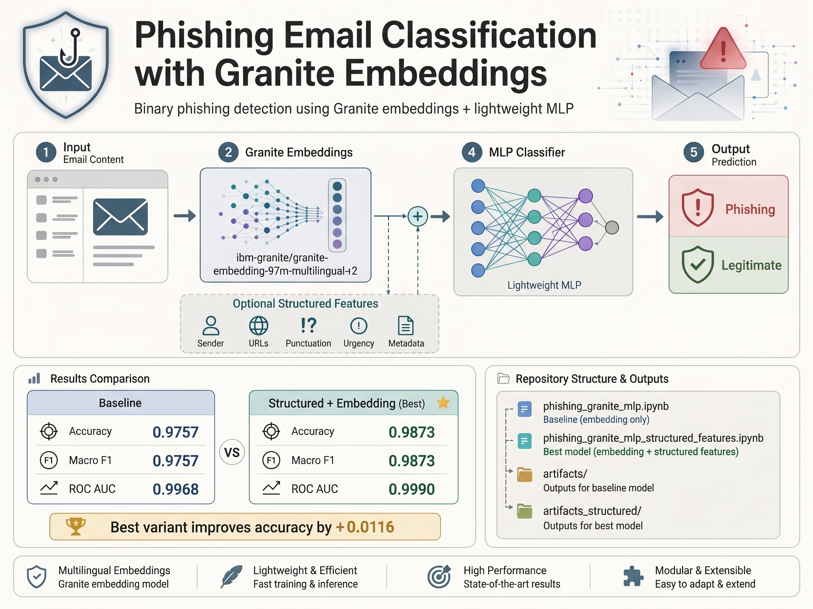

# Phishing Email Classification with Granite Embeddings

This repository explores binary phishing detection using a two-stage pipeline:

1. Convert email text into dense semantic embeddings with `ibm-granite/granite-embedding-97m-multilingual-r2`.
2. Train a lightweight PyTorch `MLP` on top of those embeddings.

The project includes two notebook variants:

- `phishing_granite_mlp.ipynb`
- `phishing_granite_mlp_structured_features.ipynb`

The first notebook uses the unified `text_combined` field. The second notebook keeps the original email fields and adds structured numeric features such as sender patterns, subject/body statistics, and URL-related signals.

## Why this project

Phishing emails are not only about semantics. They also carry metadata cues:

- suspicious sender formats
- URL presence
- urgent wording
- unusual punctuation and capitalization

This project tests whether a strong embedding model is enough, or whether a hybrid approach with structured features performs better.

## Results

The structured notebook is the best-performing variant.

| Variant | Accuracy | Macro F1 | ROC AUC |
| --- | ---: | ---: | ---: |
| Baseline embedding-only | 0.9757 | 0.9757 | 0.9968 |
| Structured features + embedding | 0.9873 | 0.9873 | 0.9990 |

See [`RESULTS.md`](./RESULTS.md) for the full comparison and training notes.

## Repository Structure

- `dataset/` raw and unified phishing email CSVs
- `phishing_granite_mlp.ipynb` baseline notebook
- `phishing_granite_mlp_structured_features.ipynb` hybrid notebook
- `artifacts/` baseline model outputs
- `artifacts_structured/` structured model outputs
- `README.md` internal project documentation
- `DOC.md` step-by-step explanation for non-ML readers
- `RESULTS.md` result comparison

## How It Works

### Baseline notebook

- loads `dataset/phishing_email.csv`
- cleans and splits the data
- caches Granite embeddings
- trains an MLP classifier

### Structured notebook

- loads the original source CSV files
- rebuilds the dataset with sender, subject, body, receiver, date, and `urls`
- extracts a Granite embedding from `Subject + Body`
- creates numeric features from sender/body/subject patterns
- scales the numeric features
- concatenates embeddings + features
- trains the final MLP

## Outputs

The notebooks save their artifacts in separate folders:

- `artifacts/`
- `artifacts_structured/`

That keeps the baseline and structured experiments isolated and easy to compare.

## Running The Project

1. Activate the conda environment `fagos_ESM`.
2. Open the notebook you want to run.
3. Execute the data preparation cells first.
4. Run embedding extraction.
5. Train the MLP.
6. Review the test metrics and confusion matrix.

## Key Takeaway

The structured version is the stronger approach for this dataset. It keeps the semantic signal from Granite, but also gives the classifier the metadata cues that phishing detection depends on.
